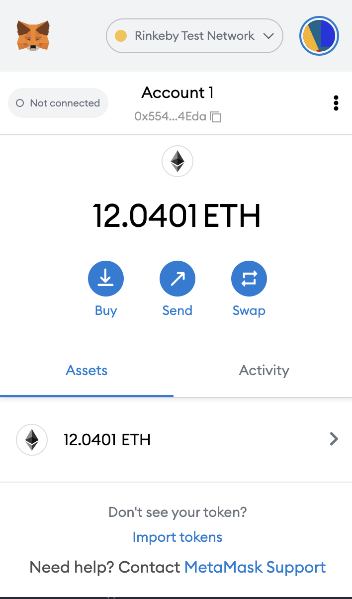
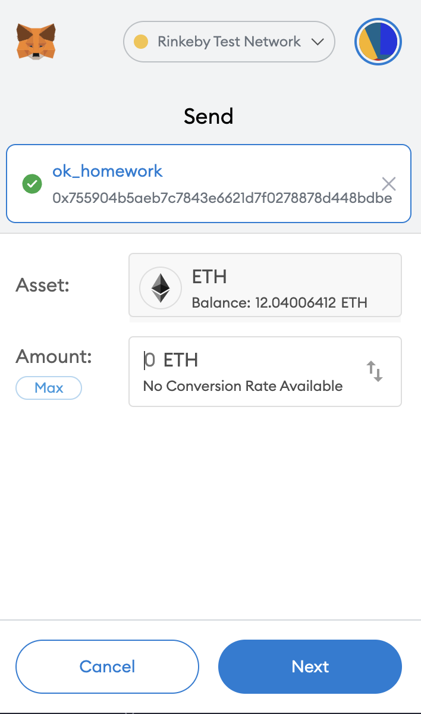
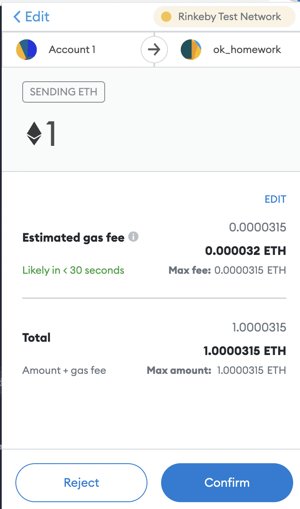
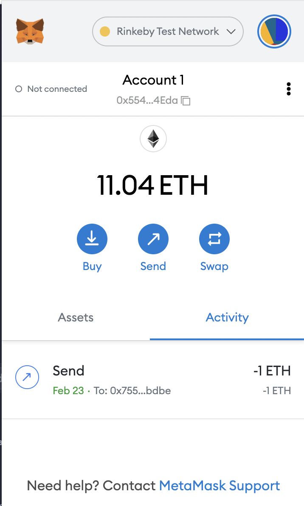
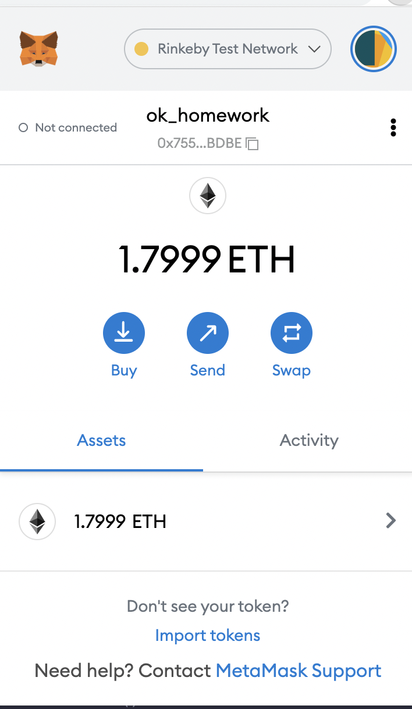
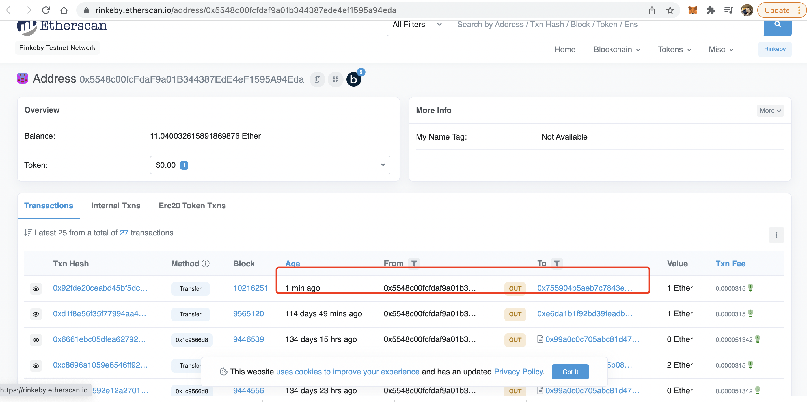
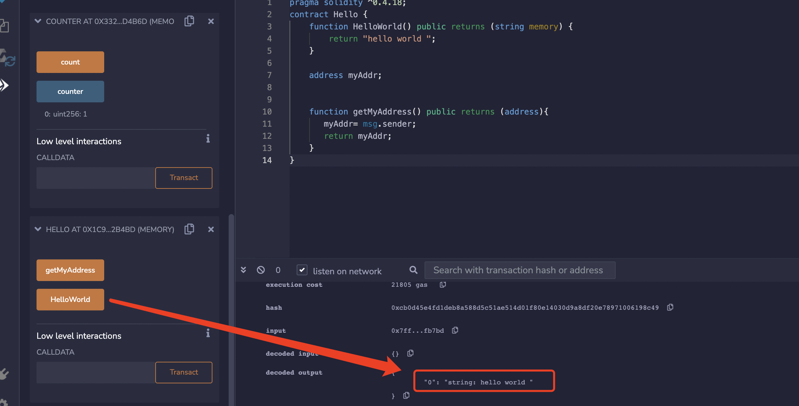
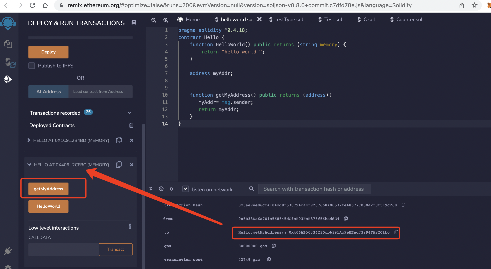
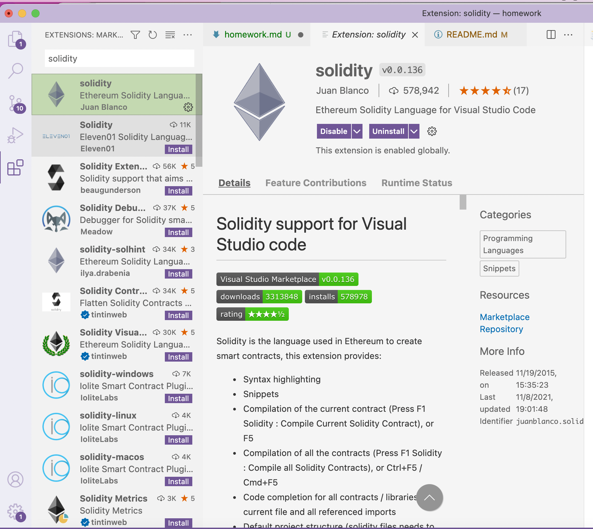

### 安装 Metamask、并创建好账号
> 0x5548c00fcfdaf9a01b344387ede4ef1595a94eda

- 


### 执行一次转账

- 转账前

  - 

- 转账中


  - 
  - 
  - 

- 转账后

  - 
  - 

> https://rinkeby.etherscan.io/address/0x5548c00fcfdaf9a01b344387ede4ef1595a94eda

### 使用 Remix 创建任意一个合约

```
pragma solidity ^0.4.18;

contract Hello {
    function HelloWorld() public returns (string memory) {
        return "hello world ";
    }

    address myAddr;

    
    function getMyAddress() public returns (address){
       myAddr= msg.sender;
       return myAddr;
    }
}
```


  - 
  - 


### VSCode IDE 开发环境配置


- 

### 使用 Truffle 部署 Counter 合约 到 test 网络（goerli）（提交交易 hash）


> 交易哈希 :0xa817f259efef2dcd5165909e741708c6302d186e19d79978af0a80b4dde9fb64

> 合约地址: 0x8e6f26913dd5a241913e292b93fde6f4f8dc9d75

> 合约url地址：https://goerli.etherscan.io/address/0x8e6f26913dd5a241913e292b93fde6f4f8dc9d75


```
pragma solidity ^0.8.0;

contract Counter {

   uint public counter;

   constructor(){
       counter =0;
   }

   function count() public {
       counter=counter+1;
   }

}
```

- 提交明细 

```
darren@darrendeMacBook-Pro w1_code % truffle migrate --network goerli

Compiling your contracts...
===========================
> Everything is up to date, there is nothing to compile.


Starting migrations...
======================
> Network name:    'goerli'
> Network id:      5
> Block gas limit: 29970705 (0x1c95111)


1_counter.js
============

   Deploying 'Migrations'
   ----------------------
   > transaction hash:    0xa817f259efef2dcd5165909e741708c6302d186e19d79978af0a80b4dde9fb64
   > Blocks: 4            Seconds: 53
   > contract address:    0x8e6F26913dD5A241913e292b93FDe6F4f8dC9d75
   > block number:        6425308
   > block timestamp:     1645606351
   > account:             0xE4F2CAa1dF0Bd8c960bE63970f4FD9f08387Cd5e
   > balance:             0.299374644995497444
   > gas used:            250142 (0x3d11e)
   > gas price:           2.500000018 gwei
   > value sent:          0 ETH
   > total cost:          0.000625355004502556 ETH

   Pausing for 2 confirmations...

   -------------------------------
   > confirmation number: 1 (block: 6425309)
   > confirmation number: 2 (block: 6425310)
   > Saving migration to chain.
   > Saving artifacts
   -------------------------------------
   > Total cost:     0.000625355004502556 ETH

Summary
=======
> Total deployments:   1
> Final cost:          0.000625355004502556 ETH

```


### 编写一个测试用例


```


var Counter = artifacts.require("Counter");

 module.exports =async function(callback){
     var counter =await Counter.deployed();

     await counter.count();
     await counter.count();

     let value =await counter.counter();

     console.log("current counter value "+value);
 }
```
 


