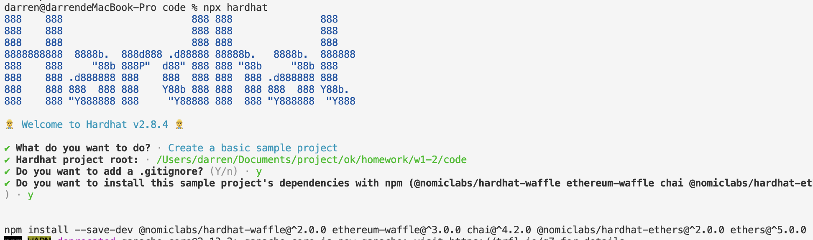
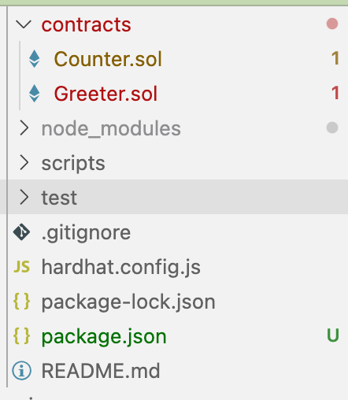
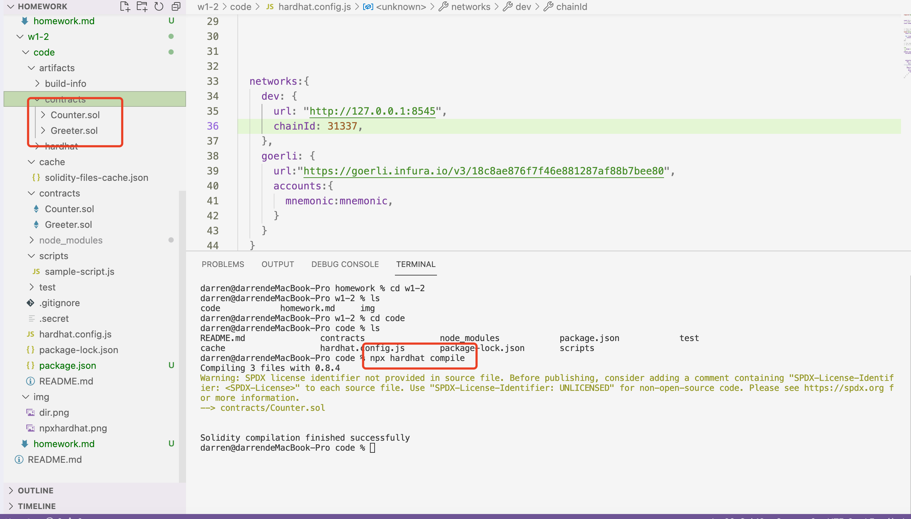
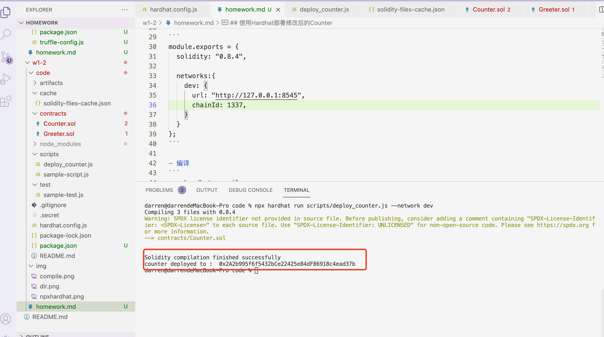
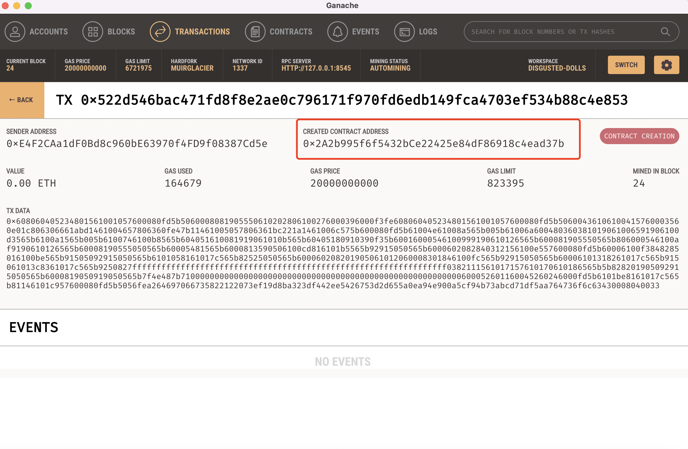
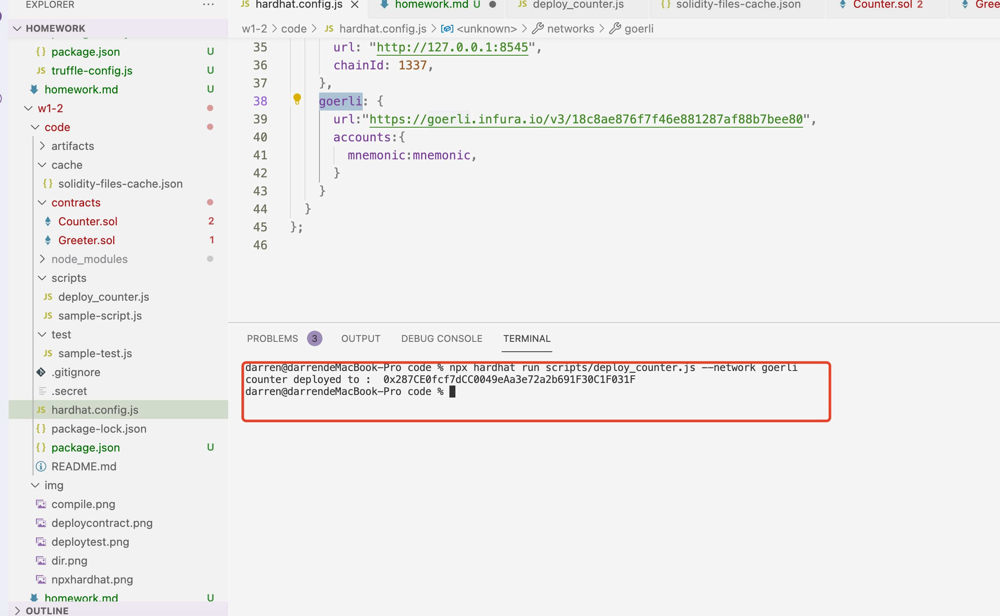

## 使用Hardhat部署修改后的Counter

- 创建hardhat工程

```
mkdir code
cd code
npm init --yes 
npm install --save-dev hardhat
```  

- 在安装hardhat的目录运行
  
```
npx hardhat 
```
-  
- 目录结构
    - 
- 下载响应的插件

```
npm install --save-dev @nomiclabs/hardhat-ethers ethers @nomiclabs/hardhat-waffle ethereum-waffle chai
```


- 在hardhat.config.js 配置网络

```
module.exports = {
  solidity: "0.8.4",

  networks:{
    dev: {
      url: "http://127.0.0.1:8545",
      chainId: 1337,
    }
  }
};
```

- 编译
```
npx hardhat compile
```

- 


- 部署到本地测试网络

  - 
  - 到测试网络ganache界面查看
  - 
 
- 部署到线上goerli测试网络

  - 
  - 看到合约地址：0x287CE0fcf7dCC0049eAa3e72a2b691F30C1F031F
  - https://goerli.etherscan.io/address/0x287CE0fcf7dCC0049eAa3e72a2b691F30C1F031F 
  - 成功部署
   
## 使用Hardhat测试Counter


- sol合约
```
pragma solidity ^0.8.0;

import "hardhat/console.sol";
contract Counter{

   uint public counter;

   constructor(){
       counter=0;
       console.log("init counter value ",counter);
   }
   function count() public {
       counter=counter+1;
       console.log("current counter value ",counter);
   }

   function set(uint x) public {
       
       counter=x ;
       console.log("current counter value ",counter);
   }

   function add(uint x) public {
       console.log("modify x ",x);
       counter=counter+x ;
        
       console.log("current counter value ",counter);
   }

}
``` 

- 测试脚本

```
const { expect } = require("chai");

describe("测试Counter合约", function() {
  it("计算+1", async function() {
    const [owner] = await ethers.getSigners();

    const Counter = await ethers.getContractFactory("Counter");

    const hardhatCounter = await Counter.deploy();
    await hardhatCounter.deployed();
  
    await hardhatCounter.count()

  
  
  });

  it("计算add(2)", async function() {
    const [owner] = await ethers.getSigners();

    const Counter = await ethers.getContractFactory("Counter");

    const hardhatCounter = await Counter.deploy();
    await hardhatCounter.deployed();
  
    await hardhatCounter.add(2)
  });
  

  it("设置set(8)", async function() {
    const [owner] = await ethers.getSigners();

    const Counter = await ethers.getContractFactory("Counter");

    const hardhatCounter = await Counter.deploy();
    await hardhatCounter.deployed();
  
    await hardhatCounter.set(8)
  });
});
```

- 输出  

```
darren@darrendeMacBook-Pro code % npx hardhat test
Compiling 1 file with 0.8.4
 
Solidity compilation finished successfully


  测试Counter合约
init counter value  0
current counter value  1
    ✓ 计算+1 (394ms)
init counter value  0
modify x  2
current counter value  2
    ✓ 计算add(2) (45ms)
init counter value  0
current counter value  8
    ✓ 设置set(8)


  3 passing (476ms)

```


## 写一个脚本调用count()

- 设置环境变量
```

export HARDHAT_NETWROK='dev'

```


- 调用add()方法
```

const {ethers,network,artifacts} = require("hardhat");

const par=process.argv
const value =par[2]

console.log("Counter deploy with value ",value );

async function main() { 
  
    const Counter = await ethers.getContractFactory("Counter");
    const counter = await Counter.deploy();
    await counter.deployed();
    console.log("Counter deployed to : ",counter.address);

    await counter.add(value)
     
     

}

main()
  .then(() => process.exit(0))
  .catch(error => {
    console.error(error);
    process.exit(1);
  });
```

- 执行脚本

```
node scripts/deploy_by_param.js 10
```
- 结果

```
darren@darrendeMacBook-Pro code % node scripts/deploy_by_param.js 10
Counter deploy with value  10
current counter value  0
Counter deployed to :  0x5FbDB2315678afecb367f032d93F642f64180aa3
add x  10
current counter value  10

```   

  
