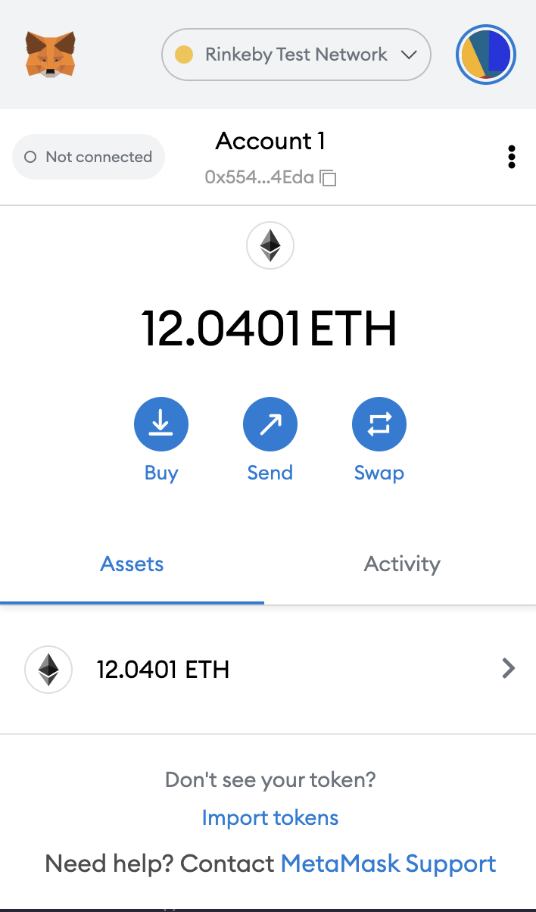

### 安装 Metamask、并创建好账号


- 


### 执行一次转账


### 使用 Remix 创建任意一个合约


### VSCode IDE 开发环境配置


### 使用 Truffle 部署 Counter 合约 到 test 网络（goerli）（提交交易 hash）


### 编写一个测试用例


//0x5548c00fcfdaf9a01b344387ede4ef1595a94eda

```
pragma solidity ^0.8.0;

contract Counter {

   uint public counter;

   constructor(){
       counter =0;
   }

   function count() public {
       counter=counter+1;
   }

}
```
