## 1.编写⼀个[Bank合约](w2-1/code/contracts/Bank.sol)

```
pragma solidity ^0.6.1;
import "./safemath.sol";

contract Bank{
    using SafeMath for uint256;
    
    mapping(address=>uint256) balances;

    string public bankName;

    uint256 toalAmount;

    uint256  numberOfHis;

    event Transfer(address from,address to,uint256 amount,uint256 timestamp,uint256 index );


    struct history{
       address from;
       address to;
       uint timestamp;
       uint256 amount;
    }

  
   

    mapping(address=> mapping(uint=>history) ) public histories;

    constructor(string memory name) public{
        bankName=name;
        toalAmount =0 ;
        numberOfHis=0;
    }

    //存钱
    function deposite(uint256 amount ) external payable{
       require(amount >0 ,"存款必须大于0");
       require(msg.value==amount,"存款必须等于value");
       balances[msg.sender] = SafeMath.add(balances[msg.sender],amount);
       toalAmount = SafeMath.add(toalAmount,amount);

       

       require(toalAmount == address(this).balance ,"银行余额校验");

    }

    
     //取钱
    function withdraw(uint256 amount ) external payable{
       require(amount >0 ,"取钱必须大于0");
       require( balances[msg.sender] >=amount,"取钱必须等于value");
       msg.sender.transfer(amount);
       balances[msg.sender] = SafeMath.sub(balances[msg.sender],amount);
       toalAmount = SafeMath.sub(toalAmount,amount);

      

       require(toalAmount == address(this).balance ,"银行余额校验");

    }
 
    // 转账

    function transfer(address to,uint256 amount ) external{
       require(amount >0 ,"金额必须大于0");
       require(balances[msg.sender]>=amount,"钱必须足够");
       require(address(0) !=to, "to必须是一个有效地址");
       balances[msg.sender] = SafeMath.sub(balances[msg.sender],amount);
       balances[to] = SafeMath.add(balances[to],amount);


      //存储历史记录
       histories[msg.sender][numberOfHis].timestamp=now;
       histories[msg.sender][numberOfHis].from=msg.sender;
       histories[msg.sender][numberOfHis].to=to;
       histories[msg.sender][numberOfHis].amount=amount;
       

       emit Transfer(msg.sender,to,amount,now,numberOfHis);
       numberOfHis++;
       require(toalAmount == address(this).balance ,"银行余额校验");

    }

    function getBalance() external view returns (uint256){
       return balances[msg.sender];
    }

    function getTotalAmount() external view returns(uint256,uint256){
       return (toalAmount,address(this).balance);
    }
 

} 
```
- 编译
  ```
  darren@darrendeMacBook-Pro code % pwd
   /Users/darren/Documents/project/ok/homework/w2-1/code
   darren@darrendeMacBook-Pro code % truffle compile

   Compiling your contracts...
   ===========================
   `> Compiling ./contracts/Bank.sol
   > Compilation warnings encountered:

      project:/contracts/Bank.sol: Warning: SPDX license identifier not provided in source file. Before publishing, consider adding a comment containing "SPDX-License-Identifier: <SPDX-License>" to each source file. Use "SPDX-License-Identifier: UNLICENSED" for non-open-source code. Please see https://spdx.org for more information.
   ,project:/contracts/safemath.sol: Warning: SPDX license identifier not provided in source file. Before publishing, consider adding a comment containing "SPDX-License-Identifier: <SPDX-License>" to each source file. Use "SPDX-License-Identifier: UNLICENSED" for non-open-source code. Please see https://spdx.org for more information.

   > Artifacts written to /Users/darren/Documents/project/ok/homework/w2-1/code/build/contracts
   > Compiled successfully using:
      - solc: 0.6.11+commit.5ef660b1.Emscripte`n.clang
  ```
  


- 测试
       

      darren@darrendeMacBook-Pro code % truffle test
      Using network 'development'.

         Compiling your contracts...
         ===========================
         > Compiling ./contracts/Bank.sol
         > Compilation warnings encountered:

            project:/contracts/Bank.sol: Warning: SPDX license identifier not provided in source file. Before publishing, consider adding a comment containing "SPDX-License-Identifier: <SPDX-License>" to each source file. Use "SPDX-License-Identifier: UNLICENSED" for non-open-source code. Please see https://spdx.org for more information.
         ,project:/contracts/safemath.sol: Warning: SPDX license identifier not provided in source file. Before publishing, consider adding a comment containing "SPDX-License-Identifier: <SPDX-License>" to each source file. Use "SPDX-License-Identifier: UNLICENSED" for non-open-source code. Please see https://spdx.org for more information.

      > Artifacts written to /var/folders/yw/k_z0z4393mz698xzl0df6_t80000gn/T/test--52991-2znYgdEaz9vH
      > Compiled successfully using:
         - solc: 0.6.11+commit.5ef660b1.Emscripten.clang


         Contract: Bank
         李佳银行
            ✓ 得到银行名称 (129ms)
         BN { negative: 0, words: [ 10, <1 empty item> ], length: 1, red: null }
            ✓ 存款 (347ms)
            ✓ 取款 (428ms)


         3 passing (1s)

      


## 通过 Metamask 向Bank合约转账ETH

- 转账
  - 转账之前:
    - 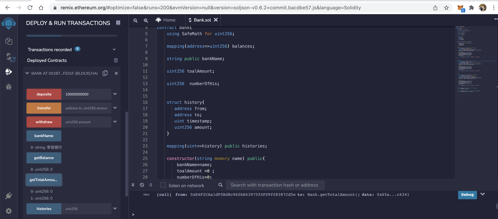
  - 转账:
    - 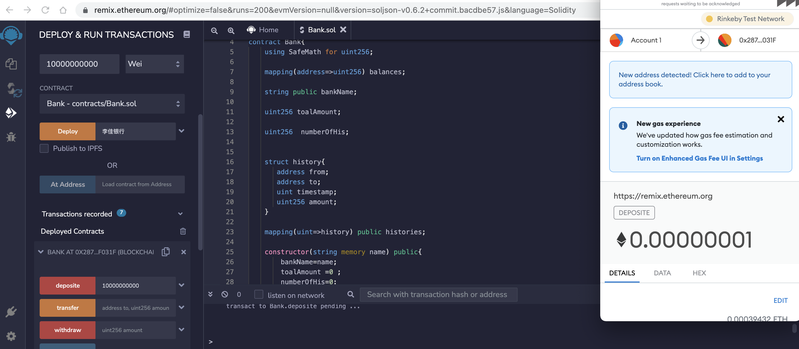
  - 转账之后   
    - 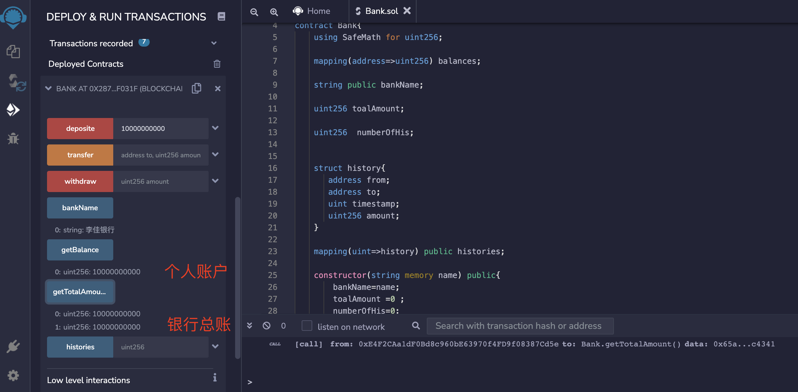
 
- 存款记录RinkeBy URL:https://rinkeby.etherscan.io/address/0x287ce0fcf7dcc0049eaa3e72a2b691f30c1f031f

- 

## 在Bank合约记录每个地址转账⾦额

- 转账动作
  - 转账之前:
    - 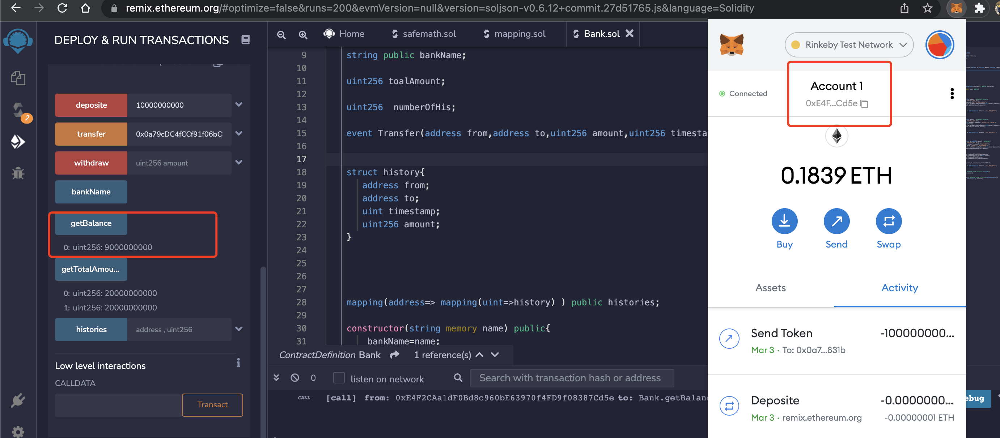
    - 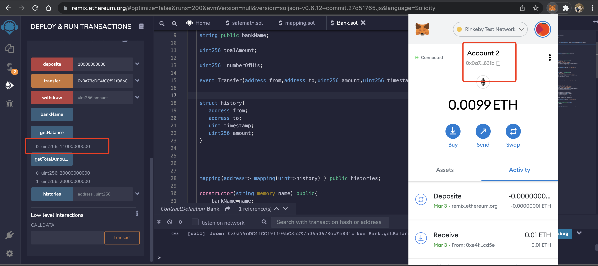
  - 转账:
    -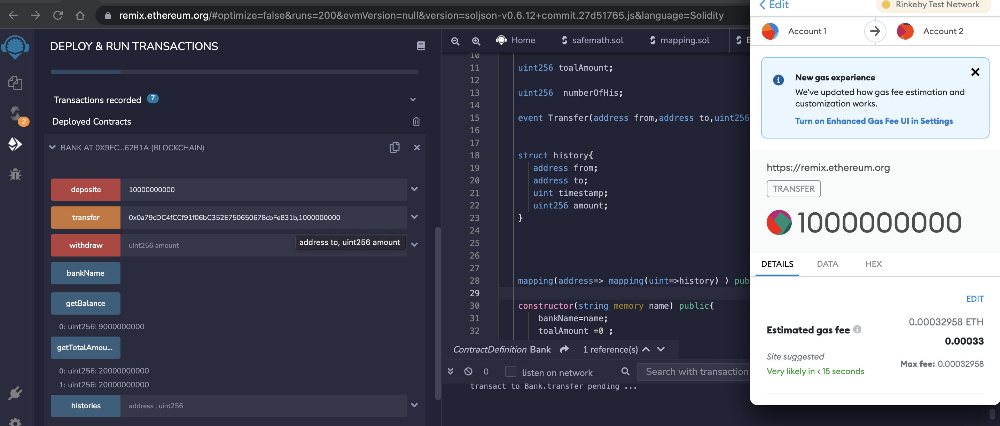
  - 转账之后   
    - 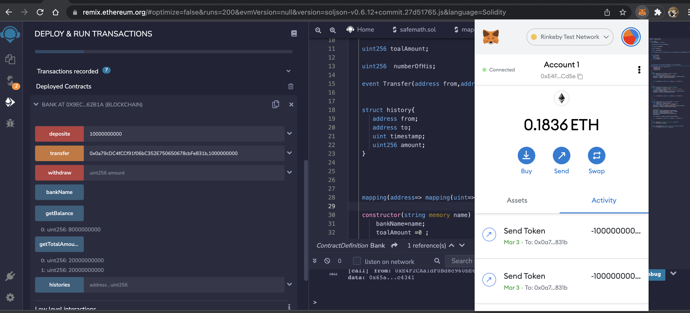

- [转账日志](https://rinkeby.etherscan.io/tx/0xadad76d9d863e1b73dd045c38039ccb90ccb48583a69060c2684adb95ecf7011#eventlog)
  - 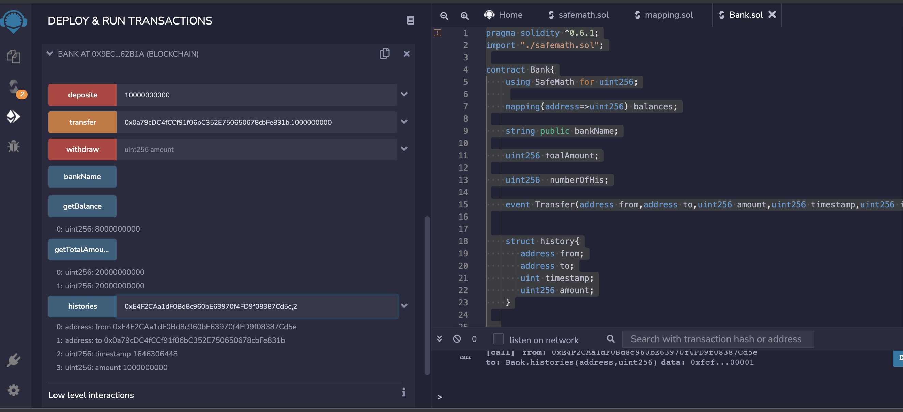
  - 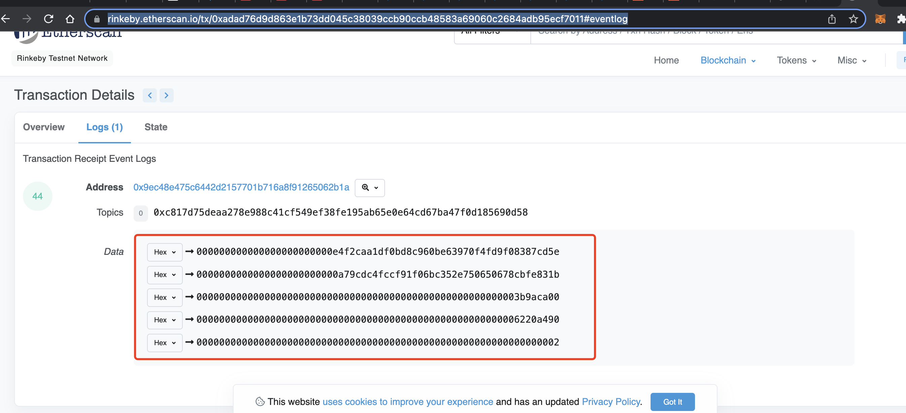


## 编写 Bank合约withdraw(), 实现提取出所有的 ETH

- 提现
  - 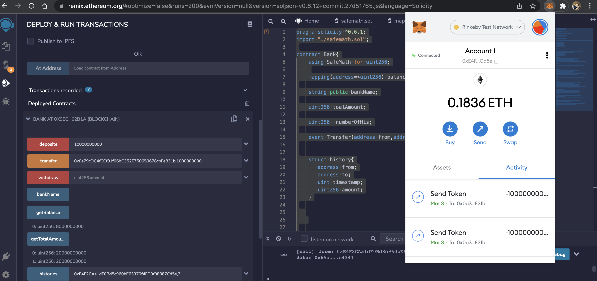
  - 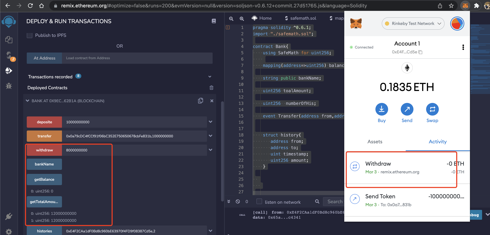
- 提现交易hash地址 :https://rinkeby.etherscan.io/tx/0xc96b4e5656b2155cd2137731b4e4f9b8c4e46d056bd66a4c9eec0a987264bee1