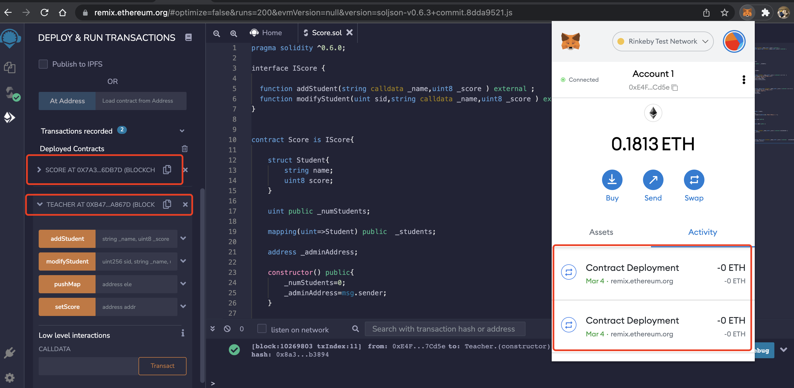
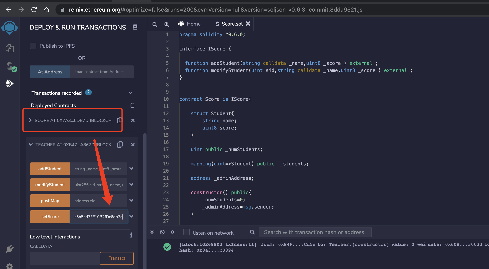
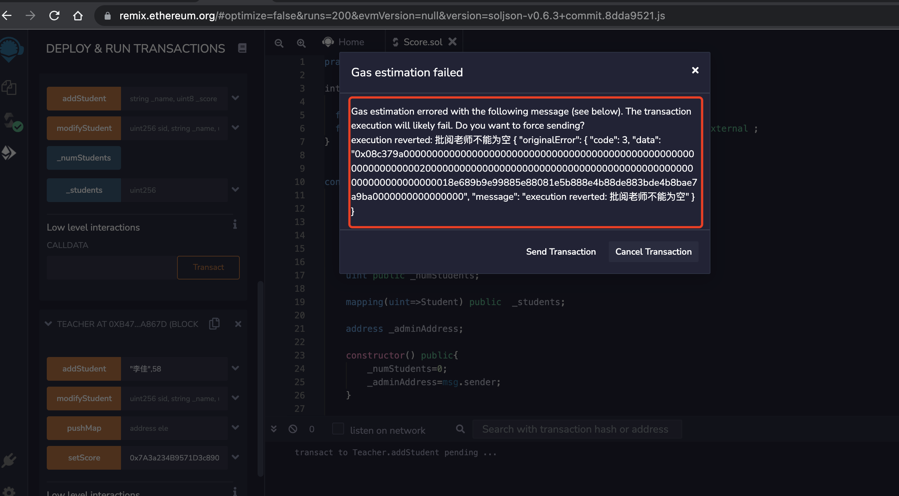
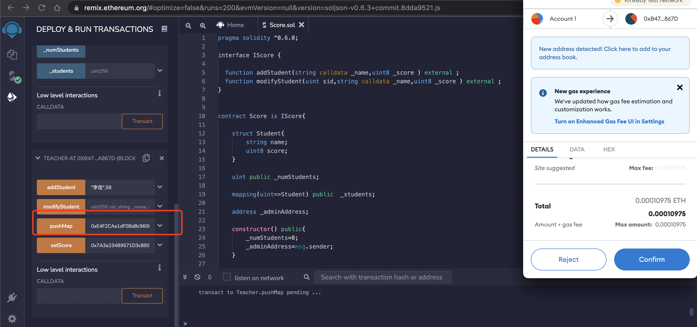
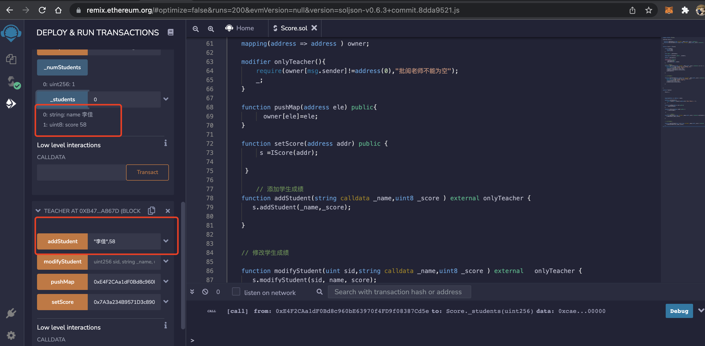
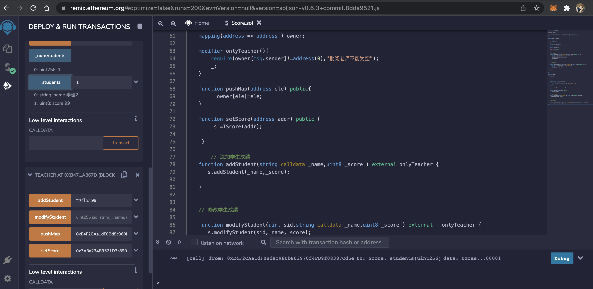
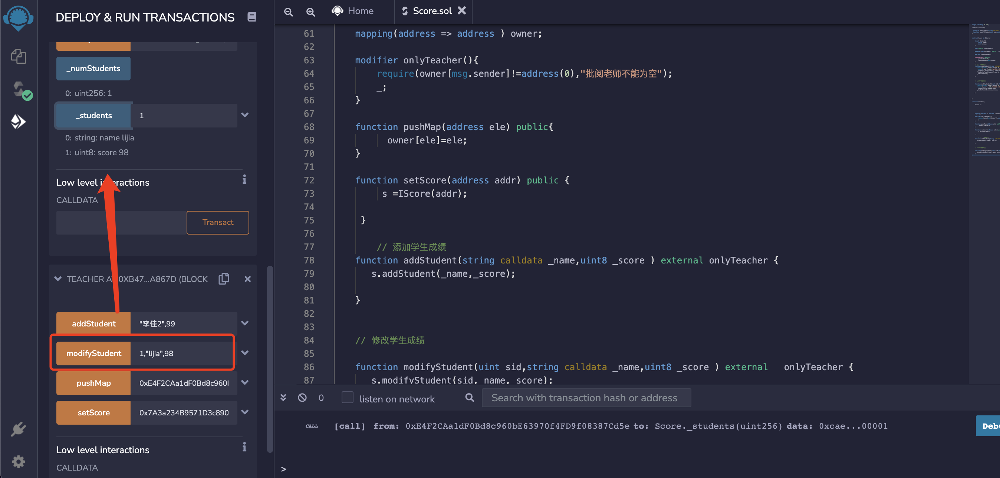

## W2_2作业
* 编写合约Score，⽤于记录学⽣（地址）分数：
   * 仅有⽼师（⽤modifier权限控制）可以添加和修改学⽣分数
   * 分数不可以⼤于 100； 
* 编写合约 Teacher 作为⽼师，通过 IScore 接⼝调⽤修改学⽣分数。

 
## [源码](w2-2/code/contracts/Score.sol) 

- 编译成功 

```
darren@darrendeMacBook-Pro code % truffle compile

Compiling your contracts...
===========================
> Compiling ./contracts/Migrations.sol
> Compiling ./contracts/Score.sol
> Compilation warnings encountered:

    project:/contracts/Score.sol: Warning: SPDX license identifier not provided in source file. Before publishing, consider adding a comment containing "SPDX-License-Identifier: <SPDX-License>" to each source file. Use "SPDX-License-Identifier: UNLICENSED" for non-open-source code. Please see https://spdx.org for more information.

> Artifacts written to /Users/darren/Documents/project/ok/homework/w2-2/code/build/contracts
> Compiled successfully using:
   - solc: 0.6.11+commit.5ef660b1.Emscripten.clang
```

## 过程

- 交易哈希url :https://rinkeby.etherscan.io/address/0xb476cd65bdf6244827ed1e3edfe8c233394a867d


> 部署两个合约,Score合约和Teacher合约
- 
> 用Score合约的地址,让Teacher合约调用.
- 


> 如果没有将地址授权给Teacher合约 

- 

> 因此将当前的账户地址授权给Teacher合约

- 

> 进行添加学生成绩,修改学生成绩.查看状态.


- 
- 
- 


- 


