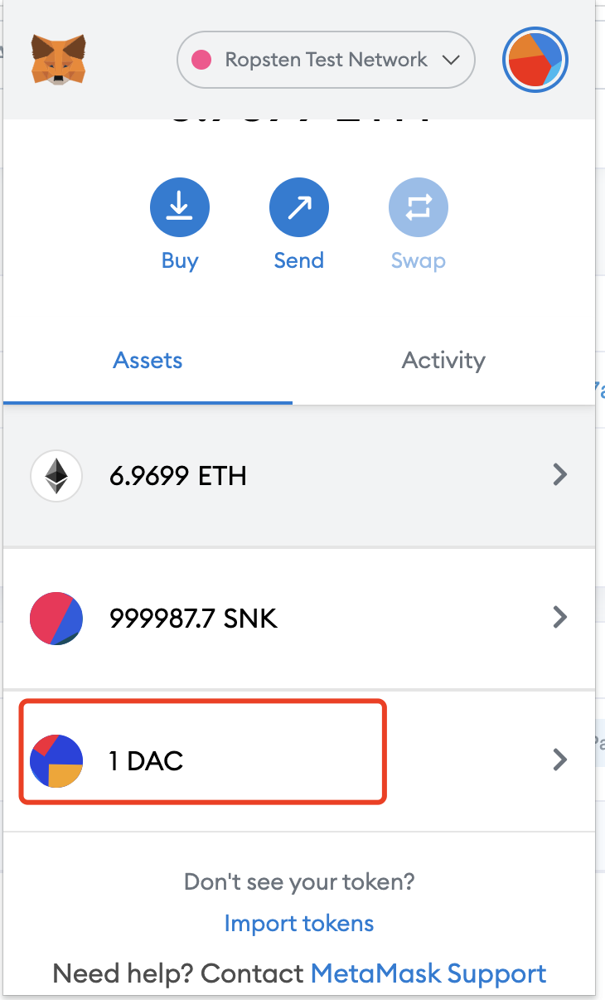
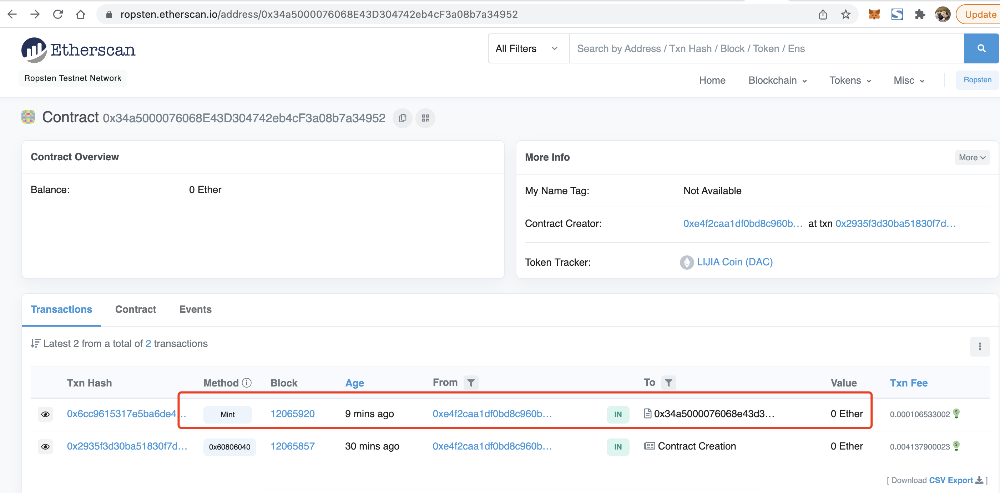
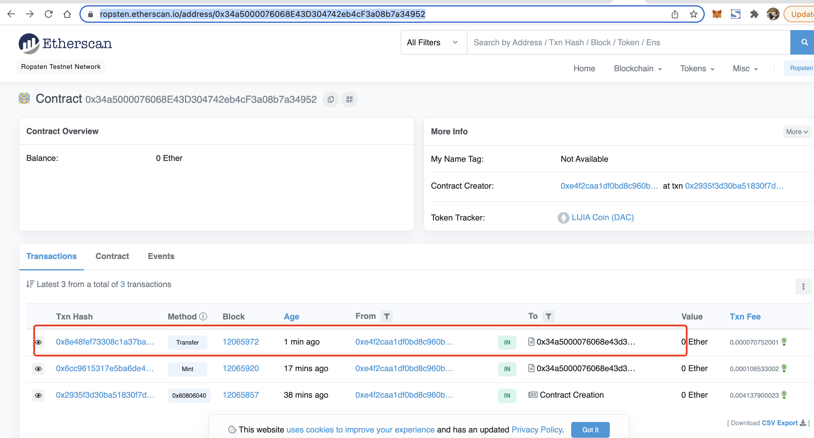

## W3_1作业
* 发⾏⼀个 ERC20 Token： 
   * 可动态增发（起始发⾏量是 0） 
   * 通过 ethers.js. 调⽤合约进⾏转账
* 编写⼀个Vault 合约：
   * 编写deposite ⽅法，实现 ERC20 存⼊ Vault，并记录每个⽤户存款⾦额 ， ⽤从前端调⽤（Approve，transferFrom） 
   * 编写 withdraw ⽅法，提取⽤户⾃⼰的存款 （前端调⽤）
   * 前端显示⽤户存款⾦额


[ethers.js文档](https://learnblockchain.cn/docs/ethers.js/getting-started.html)


## 作业细节 

###  发⾏⼀个 ERC20 Token

- 初始化环境

```
$ npm init -y	//初始化npm环境
$ npm install truffle -g //安装truffle过就请跳过
$ truffle init	//初始化truffle环境
$ npm install @openzeppelin/contracts@2.5.0	//安装openzeppelin合约
$ npm install --save ethers
 
$ npm install fs-extra@8.1.0 solc@0.5.11  

 
```

- 在contracts下,创建[MyToken.sol](w3-1/code1/contracts/MyToken.sol)
- 编译
  ```
   darren@darrendeMacBook-Pro code1 % truffle compile  

   Compiling your contracts...
   ===========================
   > Compiling ./contracts/MyToken.sol
   > Artifacts written to /Users/darren/Documents/project/ok/homework/w3-1/code1/build/contracts
   > Compiled successfully using:
      - solc: 0.5.0+commit.1d4f565a.Emscripten.clang
  ```

- 部署,[源码](w3-1/code1/migrations/2_deploy_coin.js).可动态增发（起始发⾏量是 0） 


 ```
  truffle migrate --network ropsten
 ``` 
 - 部署结果
  
 ```
      darren@darrendeMacBook-Pro code1 %  truffle migrate --network ropsten

      Compiling your contracts...
      ===========================
      > Compiling ./contracts/MyToken.sol
      > Artifacts written to /Users/darren/Documents/project/ok/homework/w3-1/code1/build/contracts
      > Compiled successfully using:
         - solc: 0.5.0+commit.1d4f565a.Emscripten.clang


      Starting migrations...
      ======================
      > Network name:    'ropsten'
      > Network id:      3
      > Block gas limit: 8000000 (0x7a1200)


      2_deploy_coin.js
      ================

         Deploying 'MyToken'
         -------------------
         > transaction hash:    0x2935f3d30ba51830f7d1eb1ecf8f42010de725e73584d38ae6d7ff2a6b8a410e
         > Blocks: 1            Seconds: 21
         > contract address:    0x34a5000076068E43D304742eb4cF3a08b7a34952
         > block number:        12065857
         > block timestamp:     1646879020
         > account:             0xE4F2CAa1dF0Bd8c960bE63970f4FD9f08387Cd5e
         > balance:             6.970109973058116029
         > gas used:            1655160 (0x194178)
         > gas price:           2.500000014 gwei
         > value sent:          0 ETH
         > total cost:          0.00413790002317224 ETH

 ``` 
 
 - 合约hash URL: https://ropsten.etherscan.io/token/0x34a5000076068E43D304742eb4cF3a08b7a34952


- 测试,[源码](w3-1/code1/test/test.js)
  - 动态增发,调用ether.js  
  ```
    // 动态增发100单位的DAC
    let mint = await erc20.functions.mint("0xE4F2CAa1dF0Bd8c960bE63970f4FD9f08387Cd5e",100)
    console.log(mint)
  ```
  - 
  - 交易hash :https://ropsten.etherscan.io/tx/0x6cc9615317e5ba6de4155bfc23b2b07b6c6100b8a2f3dd4d3e8b67e9031bbf4b
  - 
- 测试转账
  - 调用ether.js转账给 0x0a79cDC4fCCf91f06bC352E750650678cbFe831b
  - [脚本](w3-1/code1/test/test.js)
  - 转账hash URL: https://ropsten.etherscan.io/tx/0x8e48fef73308c1a37ba8f5cdbc4f496b4bcaeead4da72de05e7099e1645560ad
  - 
  -  


### 编写⼀个Vault 合约

- 初始化环境

```
$ npm init -y	//初始化npm环境
$ npm install truffle -g //安装truffle过就请跳过
$ truffle init	//初始化truffle环境
$ npm install @openzeppelin/contracts@2.5.0	//安装openzeppelin合约
$ npm install --save ethers
$ npm install @truffle/hdwallet-provider 
$ npm install fs-extra@8.1.0 solc@0.5.11  

 
```

- 在contract文件下,创建vault合约.