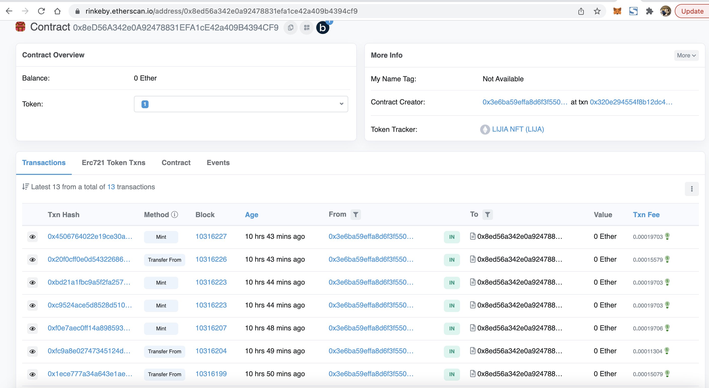
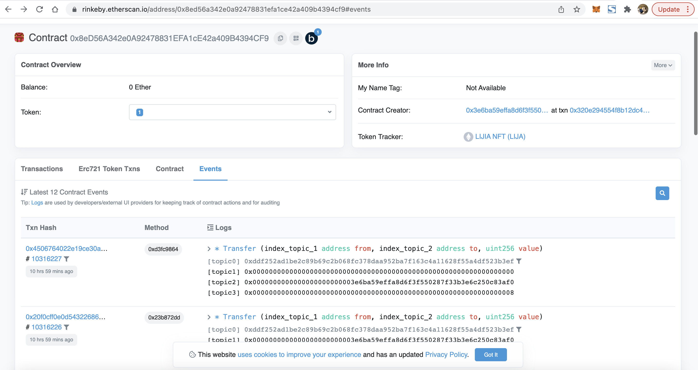

* 发行一个 ERC721 Token
   * 使用 ether.js 解析 ERC721 转账事件(加分项：记录到数据库中，可方便查询用户持有的所有NFT)
   * (或)使用 TheGraph 解析 ERC721 转账事件


## 部署环境


- 创建hardhat工程

```
mkdir code1
cd code
npm init --yes 
npm install --save-dev hardhat
```  

- 在安装hardhat的目录运行
  
```
npx hardhat 
```
 

```
npm install --save-dev @nomiclabs/hardhat-ethers ethers @nomiclabs/hardhat-waffle ethereum-waffle chai
```


- 在hardhat.config.js 配置网络

```
module.exports = {
  solidity: "0.8.4",

  networks:{
    dev: {
      url: "http://127.0.0.1:7545",
      chainId: 1337,
    }
  }
};
```

- 编译
```
npx hardhat compile
```

- 部署到相应的网络
```
npx hardhat run scripts/deploy_erc721.js --network dev  
```

地址:https://rinkeby.etherscan.io/tx/0x320e294554f8b12dc46560662188c157e62936b2e770b58ecda2c80feac42a48


### 使用 ether.js 解析 ERC721 转账事件


- 基本信息
  -  LIJIA NFT (LIJA)
  - 合约URL地址:https://rinkeby.etherscan.io/address/0x8ed56a342e0a92478831efa1ce42a409b4394cf9
  - 
  - 

- 编写解析[代码](code1/scripts/parse_log.js)

```
darren@darrendeMacBook-Pro code1 % npx hardhat run scripts/parse_log.js --network rinkeby
from:0x0000000000000000000000000000000000000000
to:0x3E6ba59EfFa8d6f3f550287F33b3E6C250C83af0
value:1
from:0x0000000000000000000000000000000000000000
to:0x3E6ba59EfFa8d6f3f550287F33b3E6C250C83af0
value:2
from:0x0000000000000000000000000000000000000000
to:0x3E6ba59EfFa8d6f3f550287F33b3E6C250C83af0
value:3
darren@darrendeMacBook-Pro code1 % npx hardhat run scripts/parse_log.js --network rinkeby
_from:0x0000000000000000000000000000000000000000
_to:0x3E6ba59EfFa8d6f3f550287F33b3E6C250C83af0
_tokenId :1
_from:0x0000000000000000000000000000000000000000
_to:0x3E6ba59EfFa8d6f3f550287F33b3E6C250C83af0
_tokenId :2
_from:0x0000000000000000000000000000000000000000
_to:0x3E6ba59EfFa8d6f3f550287F33b3E6C250C83af0
_tokenId :3
_from:0x0000000000000000000000000000000000000000
_to:0x3E6ba59EfFa8d6f3f550287F33b3E6C250C83af0
_tokenId :4
_from:0x3E6ba59EfFa8d6f3f550287F33b3E6C250C83af0
_to:0x8eD56A342e0A92478831EFA1cE42a409B4394CF9
_tokenId :1
_from:0x3E6ba59EfFa8d6f3f550287F33b3E6C250C83af0
_to:0x8eD56A342e0A92478831EFA1cE42a409B4394CF9
_tokenId :2
_from:0x0000000000000000000000000000000000000000
_to:0x3E6ba59EfFa8d6f3f550287F33b3E6C250C83af0
_tokenId :5
_from:0x0000000000000000000000000000000000000000
_to:0x3E6ba59EfFa8d6f3f550287F33b3E6C250C83af0
_tokenId :6
_from:0x0000000000000000000000000000000000000000
_to:0x3E6ba59EfFa8d6f3f550287F33b3E6C250C83af0
_tokenId :7
_from:0x3E6ba59EfFa8d6f3f550287F33b3E6C250C83af0
_to:0xD3Bbf16bdCb574803782f75d67e53513Ec2271Bc
_tokenId :7
_from:0x0000000000000000000000000000000000000000
_to:0x3E6ba59EfFa8d6f3f550287F33b3E6C250C83af0
_tokenId :8
``` 
  

- 部署mysql环境 

```
// 下载镜像
darren@darrendeMacBook-Pro funding-with-react % docker pull mysql/mysql-server
Using default tag: latest
latest: Pulling from mysql/mysql-server
78f907cdf4ab: Pull complete 
035805736c03: Pull complete 
d2d0a5329a4d: Pull complete 
e550adc3fc8c: Pull complete 
9d764ef2813b: Pull complete 
6f9519148988: Pull complete 
906914afa910: Pull complete 
Digest: sha256:91170bd4e012f0bf46b5141a38b612427b37692e8465cdffe9b0ca2d74d37d8a
Status: Downloaded newer image for mysql/mysql-server:latest
docker.io/mysql/mysql-server:latest
darren@darrendeMacBook-Pro funding-with-react % docker images
REPOSITORY                                      TAG                                                     IMAGE ID       CREATED         SIZE
 
mysql/mysql-server                              latest                                                  087c6f86492c   4 months ago    509MB
 

// docker部署 
darren@darrendeMacBook-Pro funding-with-react % docker run -itd --name mysql-test -p 3306:3306 -e MYSQL_ROOT_PASSWORD=123456 mysql/mysql-server:latest                               
ecc04af3e28d11eca2dd753d9b96a3b97dcb94d6ffefd5a2f59579a7595c5c31
darren@darrendeMacBook-Pro funding-with-react % docker ps -a
CONTAINER ID   IMAGE                       COMMAND                  CREATED         STATUS                            PORTS                                     NAMES
ecc04af3e28d   mysql/mysql-server:latest   "/entrypoint.sh mysq…"   3 seconds ago   Up 2 seconds (health: starting)   0.0.0.0:3306->3306/tcp, 33060-33061/tcp   mysql-test
darren@darrendeMacBook-Pro funding-with-react % docker ps -a
CONTAINER ID   IMAGE                       COMMAND                  CREATED         STATUS                            PORTS                                     NAMES
ecc04af3e28d   mysql/mysql-server:latest   "/entrypoint.sh mysq…"   8 seconds ago   Up 7 seconds (health: starting)   0.0.0.0:3306->3306/tcp, 33060-33061/tcp   mysql-test

// 进入数据库
darren@darrendeMacBook-Pro funding-with-react % docker exec -it mysql-test bash
bash-4.4# mysql -u root -p
Enter password: 
Welcome to the MySQL monitor.  Commands end with ; or \g.
Your MySQL connection id is 9
Server version: 8.0.27 MySQL Community Server - GPL

Copyright (c) 2000, 2021, Oracle and/or its affiliates.

Oracle is a registered trademark of Oracle Corporation and/or its
affiliates. Other names may be trademarks of their respective
owners.

Type 'help;' or '\h' for help. Type '\c' to clear the current input statement.

mysql> show databses;
ERROR 1064 (42000): You have an error in your SQL syntax; check the manual that corresponds to your MySQL server version for the right syntax to use near 'databses' at line 1
mysql> show databases;
+--------------------+
| Database           |
+--------------------+
| information_schema |
| mysql              |
| performance_schema |
| sys                |
+--------------------+
4 rows in set (0.02 sec)

// 创建数据库 eth_event_log
mysql> create database eth_event_log;
Query OK, 1 row affected (0.02 sec)


```


- 创建两张表,一张表记录用户地址,一张表记录token所属 .

```
CREATE TABLE `eth_users` (
  `id` bigint unsigned NOT NULL AUTO_INCREMENT,
  `address` varchar(100) DEFAULT '' COMMENT '地址',
  PRIMARY KEY (`id`),
  UNIQUE KEY `uni` (`address`) USING BTREE
) ENGINE=InnoDB DEFAULT CHARSET=utf8mb4 COLLATE=utf8mb4_0900_ai_ci;

 CREATE TABLE `eth_owner` (
  `id` bigint unsigned NOT NULL AUTO_INCREMENT,
  `tokenid` varchar(100) DEFAULT '',
  `userid` bigint DEFAULT NULL,
  PRIMARY KEY (`id`)
) ENGINE=InnoDB DEFAULT CHARSET=utf8mb4 COLLATE=utf8mb4_0900_ai_ci;

```


