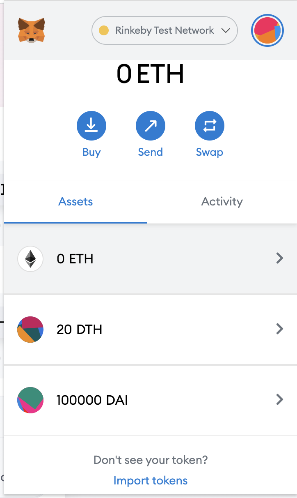
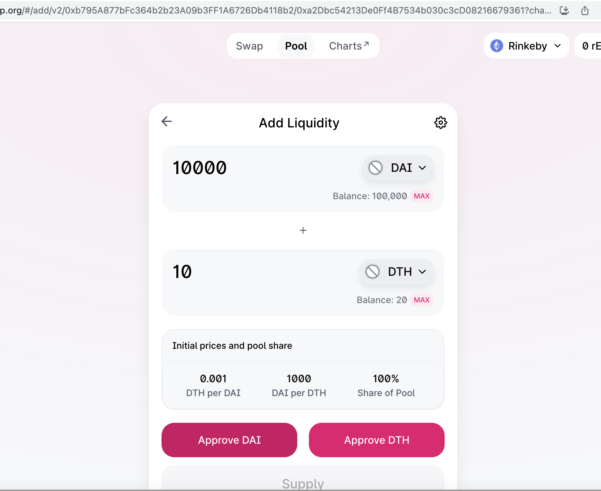
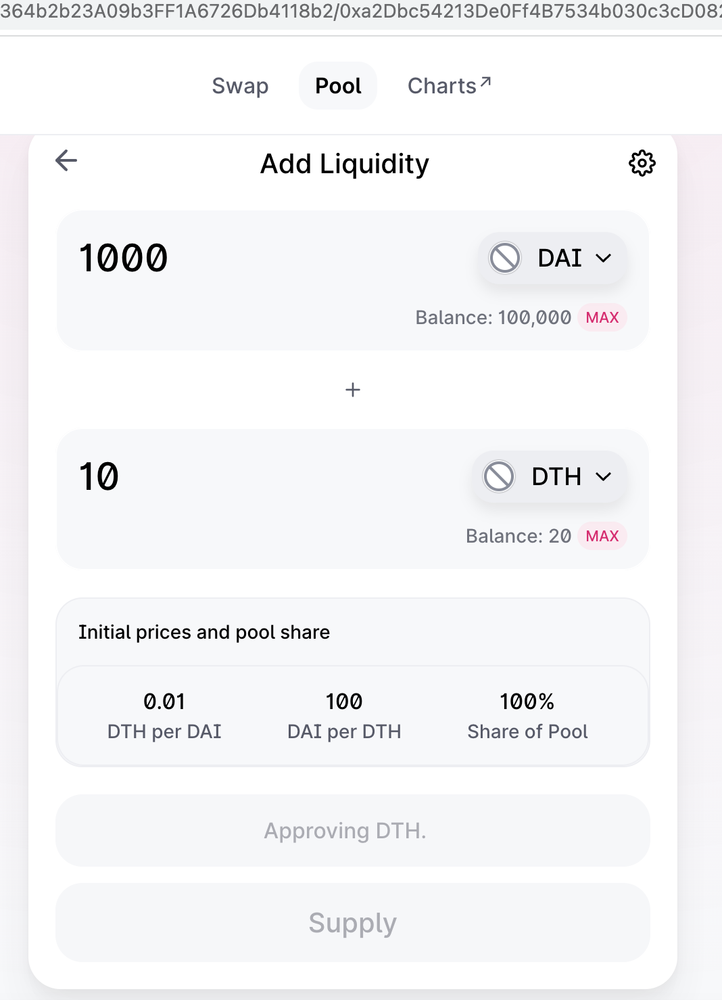
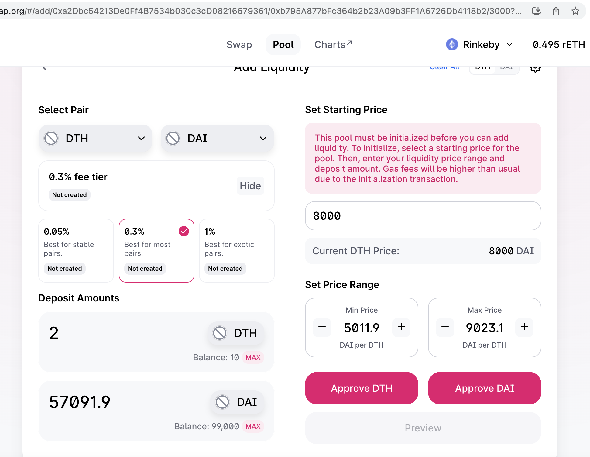
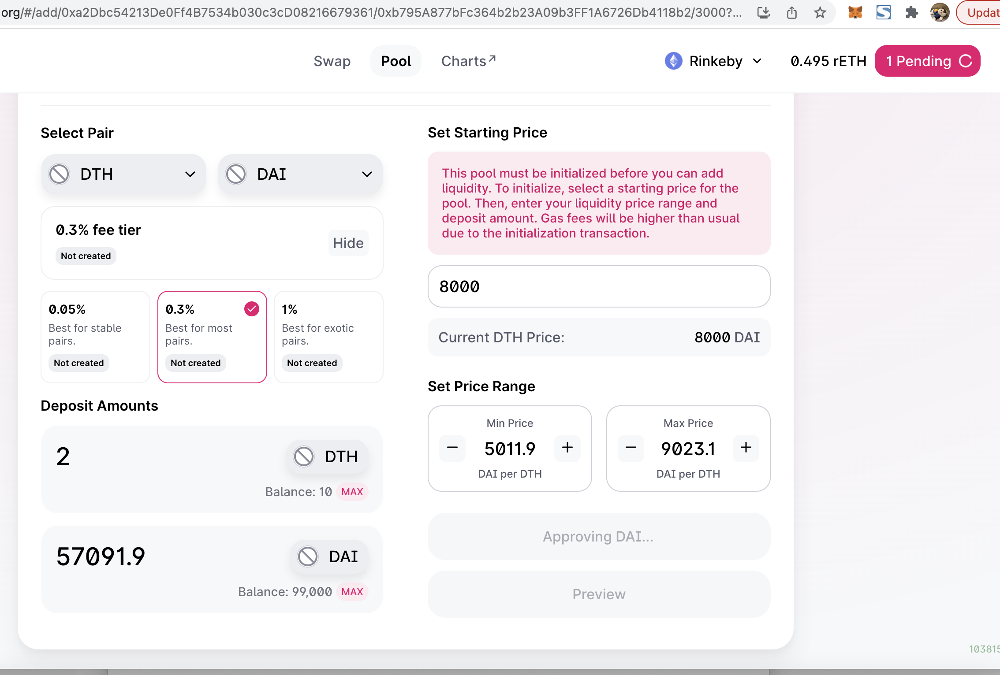
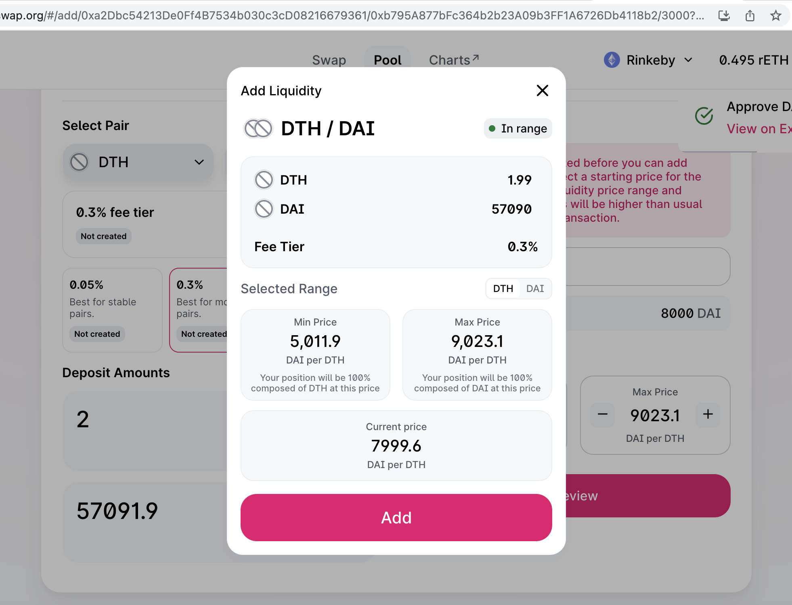
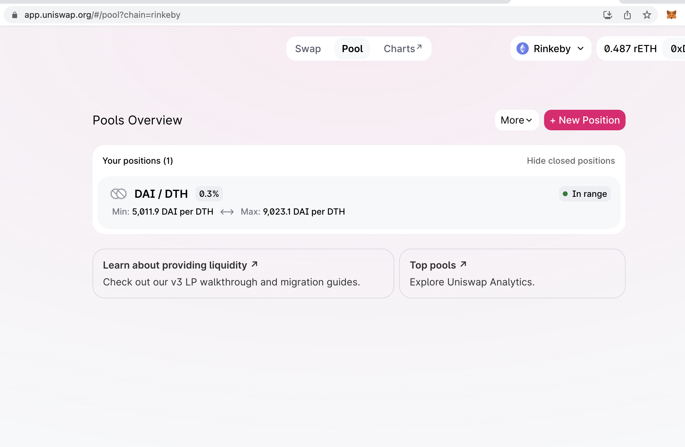
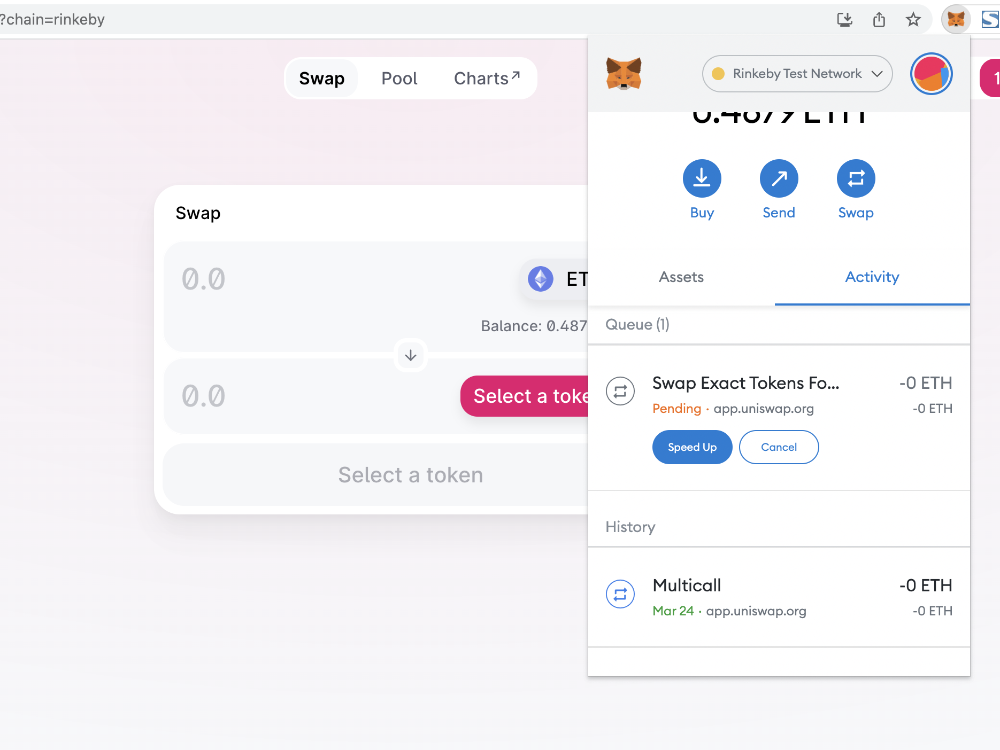

# Basic Sample Hardhat Project

This project demonstrates a basic Hardhat use case. It comes with a sample contract, a test for that contract, a sample script that deploys that contract, and an example of a task implementation, which simply lists the available accounts.

Try running some of the following tasks:

```shell
npx hardhat accounts
npx hardhat compile
npx hardhat clean
npx hardhat test
npx hardhat node
node scripts/sample-script.js
npx hardhat help
```


# 完成

* 以太坊测试网上部署两个自己的ERC20合约MyToken，分别在Uniswap V2、V3(网页上)添加流动性
* 作业：编写合约执行闪电贷（参考V2的ExampleFlashSwap）：
   * uniswapV2Call中，用收到的 TokenA 在 Uniswap V3 的 SwapRouter 兑换为 TokenB 还回到 uniswapV2 Pair 中。


- 完成MyTokend的合约编写 

```
//SPDX-License-Identifier: Unlicense
pragma solidity ^0.8.0;

import "@openzeppelin/contracts/token/ERC20/ERC20.sol";


contract Token is ERC20{
    constructor(string memory name,string memory symbol, uint256 initialSupply ) ERC20(name,symbol){

        _mint(msg.sender,initialSupply);
    }

     function decimals() public view  override returns (uint8) {
        return 2;
    }
}
```

- 测试

```
npx hardhat test
```

- 编译，部署到rinkeby网络

```
darren@darrendeMacBook-Pro w5-1 % npx hardhat run scripts/deploy_token.ts --network rinkeby
No need to generate any newer typings.
DTH的合约地址: 0xa2Dbc54213De0Ff4B7534b030c3cD08216679361
DAI的合约地址: 0xb795A877bFc364b2b23A09b3FF1A6726Db4118b2
```
https://rinkeby.etherscan.io/address/0xa2Dbc54213De0Ff4B7534b030c3cD08216679361
https://rinkeby.etherscan.io/address/0xb795A877bFc364b2b23A09b3FF1A6726Db4118b2





- 在UniswapV2操作
  - 界面
    
  - approve 批准
      
  - confirm 
      
  - pool
    
  - 完成
       

- 在UniswapV3操作
  - 初始化
    
  - pending  
    
  - 添加流动性
    
  - 完成
       
  - Swap操作
       


