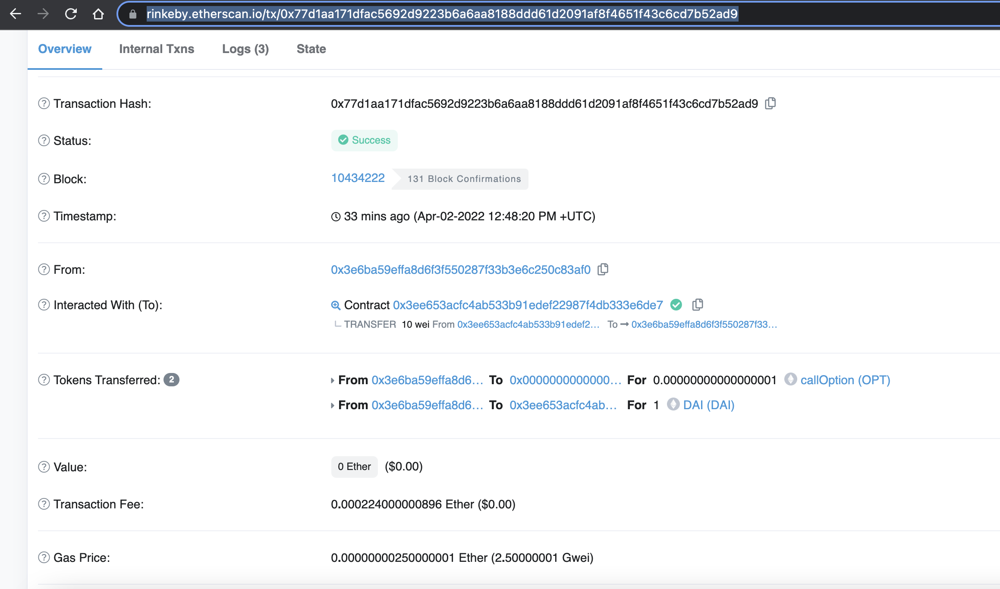
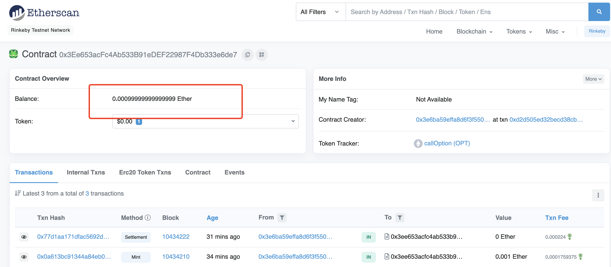

👉W6_1作业
* 设计一个看涨期权Token:
   * 创建期权Token 时，确认标的的价格与行权日期；
   * 发行方法（项目方角色）：根据转入的标的（ETH）发行期权Token；
   * （可选）：可以用期权Token 与 USDT 以一个较低的价格创建交易对，模拟用户购买期权。
   * 行权方法（用户角色）：在到期日当天，可通过指定的价格兑换出标的资产，并销毁期权Token
   * 过期销毁（项目方角色）：销毁所有期权Token 赎回标的。


## 完成 

- 配置环境

```
npm init --y 
npm install hardhat --save-dev
npx hardhat 
```

- [源码](w6-1/code/contracts/Option.sol)


- 执行脚本部署

```
darren@darrendeMacBook-Pro code % npx hardhat run scripts/1.deploy_contract.ts --network rinkeby
Generating typings for: 1 artifacts in dir: typechain for target: ethers-v5
Successfully generated 5 typings!
Compiled 1 Solidity file successfully
option address :  0x3Ee653acFc4Ab533B91eDEF22987F4Db333e6de7
```

url :https://rinkeby.etherscan.io/tx/0xd2d505ed32becd38cbd13f718187f6c71a3fbeffd339853c435653d4e3a10eb9

- 挖矿，往合约里充值eth,换期权合约 

```
darren@darrendeMacBook-Pro code % npx hardhat run scripts/2.exe_contract.ts --network rinkeby 
No need to generate any newer typings.
option address :  0x3Ee653acFc4Ab533B91eDEF22987F4Db333e6de7
```

https://rinkeby.etherscan.io/tx/0x0a613bc91344a84eb095ca5ec4441e1bc6d843eb8ed533eef3f406244c47a1f9

- 行权日到了，

https://rinkeby.etherscan.io/tx/0x77d1aa171dfac5692d9223b6a6aa8188ddd61d2091af8f4651f43c6cd7b52ad9



将期权burn,我将dai打给合约



合约将eth给我